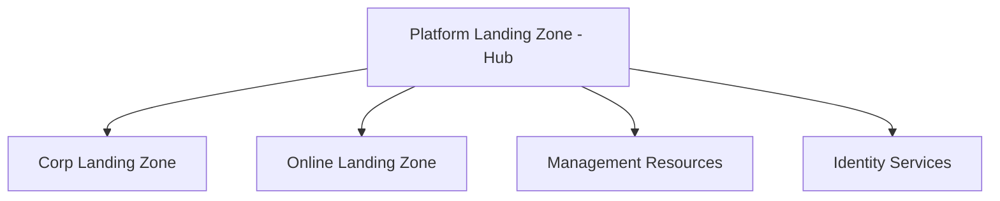
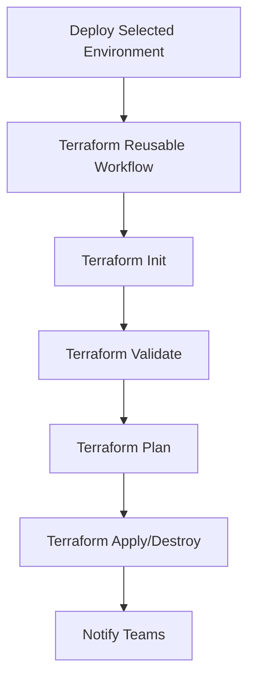

# Azure Landing Zone Terraform

This repository contains Terraform configurations for implementing Azure Landing Zones following Microsoft's Cloud Adoption Framework (CAF) best practices.

## 🏗️ Architecture Overview

This Azure Landing Zone implementation provides a scalable, secure, and well-governed foundation for enterprise Azure deployments. It follows the hub-and-spoke network topology with centralized management and connectivity.

## 📁 Repository Structure

```
azure-landing-zone/
├── landing_zones/          # Landing zone implementations
│   ├── platform/          # Platform landing zone (Hub)
│   ├── corp/              # Corporate landing zone
│   ├── online/            # Online landing zone
│   └── management_resources/ # Management and monitoring
└── Modules/               # Reusable Terraform modules
    ├── ResourceGroup/     # Resource Group module
    ├── AzureNetwork/      # Networking components
    ├── AzureCompute/      # Compute resources
    ├── AzureStorage/      # Storage solutions
    ├── AzureKeyVault/     # Key Vault management
    ├── AzureDatabase/     # Database services
    ├── AzureMonitor/      # Monitoring and diagnostics
    └── [other modules]/   # Additional Azure services
```

## 🚀 Prerequisites

1. **Azure CLI** - Install from [here](https://docs.microsoft.com/en-us/cli/azure/install-azure-cli)
2. **Terraform** - Install from [here](https://developer.hashicorp.com/terraform/tutorials/azure-get-started/install-cli)
3. **PowerShell** (for Windows) or **Bash/Zsh** (for macOS/Linux)
4. **Visual Studio Code** - Install from [here](https://code.visualstudio.com/)

## 🔧 Landing Zones

| Landing Zone | Purpose | Status | Documentation |
|--------------|---------|--------|---------------|
| **Platform** | Hub infrastructure with shared services | ✅ Available | [Platform README](./landing_zones/platform/README.md) |
| **Corp** | Corporate workloads with strict governance | ✅ Available | [Corp README](./landing_zones/corp/README.md) |
| **Online** | Internet-facing applications | ✅ Available | [Online README](./landing_zones/online/README.md) |
| **Management** | Centralized monitoring and management | ✅ Available | [Management README](./landing_zones/management_resources/README.md) |

## 📦 Available Modules

| Module Category | Modules | Status | Documentation |
|----------------|---------|--------|---------------|
| **Core** | Resource Groups | ✅ Available | [ResourceGroup](./Modules/ResourceGroup/README.md) |
| **Networking** | VNet, Subnets, NSG, App Gateway, Firewall | ✅ Available | [Networking Modules](./Modules/AzureNetwork/README.md) |
| **Compute** | Virtual Machines, Scale Sets | ✅ Available | [Compute Modules](./Modules/AzureCompute/README.md) |
| **Storage** | Storage Accounts, Blob, Files | ✅ Available | [Storage Modules](./Modules/AzureStorage/README.md) |
| **Security** | Key Vault, Certificates, Secrets | ✅ Available | [Security Modules](./Modules/AzureKeyVault/README.md) |
| **Database** | SQL Server, SQL Database | ✅ Available | [Database Modules](./Modules/AzureDatabase/README.md) |
| **Monitoring** | Log Analytics, Application Insights | ✅ Available | [Monitoring Modules](./Modules/AzureMonitor/README.md) |
| **Web Apps** | App Service, Function Apps | ✅ Available | [Web Apps Modules](./Modules/AzureWebApps/README.md) |
| **Management** | Management Groups, Policies | ✅ Available | [Management Modules](./Modules/AzureMgmt/README.md) |
| **Backup** | Recovery Services Vault | ✅ Available | [Backup Modules](./Modules/Azure_backup/README.md) |

## 🚀 Quick Start

### Method 1: GitHub Actions (Recommended for Production)

1. **Fork Repository**
   ```bash
   git clone <repository-url>
   cd azure-landing-zone
   ```

2. **Configure GitHub Secrets**
   Add the following secrets to your GitHub repository:
   
   | Secret Name | Description | Example |
   |-------------|-------------|---------|
   | `ARM_CLIENT_ID` | Service Principal Application ID | `xxxxxxxx-xxxx-xxxx-xxxx-xxxxxxxxxxxx` |
   | `ARM_CLIENT_SECRET` | Service Principal Secret | `your-service-principal-secret` |
   | `ARM_SUBSCRIPTION_ID` | Target Azure Subscription ID | `xxxxxxxx-xxxx-xxxx-xxxx-xxxxxxxxxxxx` |
   | `ARM_TENANT_ID` | Azure AD Tenant ID | `xxxxxxxx-xxxx-xxxx-xxxx-xxxxxxxxxxxx` |
   | `ARM_BACKEND_CLIENT_ID` | Backend Storage Service Principal ID | `xxxxxxxx-xxxx-xxxx-xxxx-xxxxxxxxxxxx` |
   | `ARM_BACKEND_CLIENT_SECRET` | Backend Storage Service Principal Secret | `your-backend-sp-secret` |
   | `ARM_BACKEND_TENANT_ID` | Backend Storage Tenant ID | `xxxxxxxx-xxxx-xxxx-xxxx-xxxxxxxxxxxx` |
   | `ARM_BACKEND_SUBSCRIPTION_ID` | Backend Storage Subscription ID | `xxxxxxxx-xxxx-xxxx-xxxx-xxxxxxxxxxxx` |

3. **Update Configuration Files**
   - Modify `terraform.tfvars` in each landing zone directory
   - Update network addressing and resource names
   - Configure feature toggles as needed

4. **Deploy via GitHub Actions**
   - Navigate to **Actions** tab in GitHub
   - Select **Deploy Selected Environment** workflow
   - Choose environment: `platform`, `corp`, `online`, or `management_resources`
   - Select action: `apply` or `destroy`
   - Run workflow

### Method 2: Using Deploy Scripts (Local Development)

1. **Clone Repository**
   ```bash
   git clone <repository-url>
   cd azure-landing-zone
   ```

2. **Configure Authentication**
   ```bash
   az login
   az account set --subscription "<your-subscription-id>"
   ```

3. **Update Configuration**
   - Update the Landing Zone Subscription ID in Deploy script
   - Modify `terraform.tfvars` with your specific values

4. **Deploy Landing Zone**
   ```bash
   # For PowerShell (Windows)
   .\Deploy.ps1
   
   # For Bash/Zsh (macOS/Linux)
   ./deploy.sh
   ```

### Method 3: Manual Terraform Deployment

1. **Navigate to Landing Zone**
   ```bash
   cd landing_zones/platform  # or corp/online/management_resources
   ```

2. **Initialize and Deploy**
   ```bash
   terraform init
   terraform plan
   terraform apply
   ```

## 🗂️ Deployment Patterns

### Hub-and-Spoke Architecture



### Deployment Order

1. **Management Resources** - Deploy monitoring and governance first
2. **Platform Landing Zone** - Deploy hub infrastructure
3. **Corp Landing Zone** - Deploy corporate workloads
4. **Online Landing Zone** - Deploy internet-facing applications

## 🔧 Customization Guide

### Environment-Specific Configuration

Each landing zone can be customized by modifying the `terraform.tfvars` file:

```hcl
# Example: Platform Landing Zone Configuration
resource_groups = {
  rg1 = {
    resource_group_name = "mycompany-mgmt"
    location            = "East US"
    rg_tags = {
      Environment = "Production"
      CostCenter  = "IT"
    }
  }
}
```

### Feature Toggles

Control deployment of specific resources using boolean variables:

| Variable | Purpose | Default |
|----------|---------|---------|
| `deploy_identity` | Deploy domain controllers | `false` |
| `deploy_gateway` | Deploy VPN/ExpressRoute gateway | `false` |
| `deploy_expressroute` | Deploy ExpressRoute circuit | `false` |
| `deploy_firewall` | Deploy Azure Firewall | `true` |

## 🔒 Security & Compliance Features

- **Network Security**: NSGs, Azure Firewall, Private Endpoints
- **Identity & Access**: Azure AD integration, RBAC
- **Encryption**: Key Vault for secrets management
- **Monitoring**: Comprehensive logging and alerting
- **Governance**: Azure Policy and Management Groups
- **Backup & Recovery**: Automated backup solutions

## 🚨 Troubleshooting

### Common Issues

| Issue | Solution |
|-------|----------|
| Authentication failures | Run `az login` and verify subscription access |
| Resource conflicts | Check for existing resources with same names |
| Quota limits | Verify Azure subscription limits |
| Terraform state issues | Ensure state file is accessible and not corrupted |

### Validation Commands

```bash
# Check Azure connectivity
az account show

# Validate Terraform configuration
terraform validate

# Check resource status
az resource list --resource-group <rg-name>
```

## 🔄 Cleanup and Destroy

### Using Destroy Script

```bash
# For PowerShell
.\Destroy.ps1

# For Bash/Zsh
./destroy.sh
```

### Manual Cleanup

```bash
cd landing_zones/<landing-zone>
terraform destroy
```

**Important**: Ensure the following files are present before destroying:
- `.terraform/` directory
- `terraform.tfstate` file
- `terraform.lock.hcl` file

## 📖 Documentation

Each landing zone and module contains detailed documentation including:
- Variable descriptions and examples
- Usage patterns and best practices
- Sample configurations
- Troubleshooting guides

## 🤝 Contributing

1. Fork the repository
2. Create a feature branch: `git checkout -b feature/new-module`
3. Make your changes and test thoroughly
4. Update documentation
5. Submit a pull request

### Development Guidelines

- Follow Terraform best practices
- Include comprehensive variable descriptions
- Add examples for each module
- Update README files when adding new features
- Test in non-production environment first

## 📜 License

This project is licensed under the MIT License - see the LICENSE file for details.

## 🆘 Support

For questions and support:
- Check the documentation in each module/landing zone
- Review the troubleshooting guides
- Open an issue in this repository
- Contact the platform team

## 📊 Monitoring and Governance

This landing zone includes:
- **Azure Monitor** integration for comprehensive monitoring
- **Azure Policy** for governance and compliance
- **Log Analytics** for centralized logging
- **Azure Security Center** for security recommendations
- **Cost Management** for budget tracking and optimization

## 🔄 GitHub Actions Workflows

This repository includes automated CI/CD workflows for deploying Azure Landing Zones using GitHub Actions.

### Available Workflows

| Workflow | Trigger | Purpose | Status |
|----------|---------|---------|---------|
| **Deploy Selected Environment** | Manual (workflow_dispatch) | Deploy specific landing zone | ✅ Available |
| **Terraform Reusable Workflow** | Called by other workflows | Reusable Terraform operations | ✅ Available |
| **Pull Request Validation** | Pull Request | Validate Terraform changes | 🚧 Planned |
| **Security Scanning** | Push to main | Security and compliance checks | 🚧 Planned |

### Workflow Structure



### Deploy Selected Environment Workflow

This is the main workflow for deploying landing zones.

#### Inputs

| Input | Type | Required | Default | Description |
|-------|------|----------|---------|-------------|
| `environment` | choice | ✅ | `platform` | Target landing zone (platform, corp, online, management_resources) |
| `action` | choice | ✅ | `apply` | Terraform action (apply, destroy) |
| `import_enabled` | boolean | ❌ | `false` | Enable terraform import step for existing resources |

#### Usage Example

1. **Via GitHub UI**:
   - Go to **Actions** → **Deploy Selected Environment**
   - Click **Run workflow**
   - Select environment and action
   - Click **Run workflow**

2. **Via GitHub CLI**:
   ```bash
   gh workflow run "Deploy Selected Environment" \
     --field environment=platform \
     --field action=apply \
     --field import_enabled=false
   ```

#### Sample Workflow Run

```yaml
# Example: Deploy Platform Landing Zone
environment: platform
action: apply
import_enabled: false

# This will:
# 1. Deploy all platform infrastructure
# 2. Create resource groups, VNets, NSGs
# 3. Configure Azure Firewall and gateways
# 4. Set up domain controllers (if enabled)
```

### Terraform Reusable Workflow

Reusable workflow that handles the actual Terraform operations.

#### Features

- **Multi-environment support**: Works with all landing zones
- **Secure secret management**: Uses GitHub secrets for credentials
- **Terraform state management**: Remote backend in Azure Storage
- **Import capability**: Can import existing Azure resources
- **Comprehensive logging**: Detailed output for troubleshooting

#### Workflow Steps

1. **Environment Setup**
   - Checkout code
   - Setup Terraform with specified version
   - Configure Azure authentication

2. **Terraform Operations**
   ```bash
   terraform init
   terraform validate
   terraform plan -out=tfplan
   terraform apply tfplan  # or destroy
   ```

3. **Resource Import** (if enabled)
   ```bash
   terraform import <resource_type>.<resource_name> <azure_resource_id>
   ```

4. **Cleanup**
   - Store plan files as artifacts
   - Clean sensitive outputs

### Setting Up GitHub Actions

#### 1. Service Principal Setup

Create service principals for Terraform operations:

```bash
# Create main service principal for deployments
az ad sp create-for-rbac \
  --name "sp-terraform-landingzone" \
  --role Contributor \
  --scopes /subscriptions/{subscription-id}

# Create service principal for backend storage
az ad sp create-for-rbac \
  --name "sp-terraform-backend" \
  --role "Storage Blob Data Contributor" \
  --scopes /subscriptions/{backend-subscription-id}/resourceGroups/{backend-rg}/providers/Microsoft.Storage/storageAccounts/{backend-sa}
```

#### 2. Required Permissions

| Service Principal | Scope | Role | Purpose |
|-------------------|--------|------|---------|
| Deployment SP | Subscription | Contributor | Deploy landing zone resources |
| Deployment SP | Subscription | User Access Administrator | Assign RBAC roles |
| Backend SP | Storage Account | Storage Blob Data Contributor | Access Terraform state |

#### 3. GitHub Secrets Configuration

Navigate to **Settings** → **Secrets and variables** → **Actions** and add:

```bash
# Deployment Service Principal
ARM_CLIENT_ID: "deployment-sp-app-id"
ARM_CLIENT_SECRET: "deployment-sp-secret"
ARM_SUBSCRIPTION_ID: "target-subscription-id"
ARM_TENANT_ID: "azure-ad-tenant-id"

# Backend Service Principal
ARM_BACKEND_CLIENT_ID: "backend-sp-app-id"
ARM_BACKEND_CLIENT_SECRET: "backend-sp-secret"
ARM_BACKEND_TENANT_ID: "backend-tenant-id"
ARM_BACKEND_SUBSCRIPTION_ID: "backend-subscription-id"
```

### Advanced Workflow Scenarios

#### 1. Multi-Environment Deployment

Deploy multiple environments in sequence:

```yaml
# Deploy in order: management → platform → corp → online
jobs:
  deploy-management:
    uses: ./.github/workflows/terraform-workflow.yaml
    with:
      environment: management_resources
      action: apply
  
  deploy-platform:
    needs: deploy-management
    uses: ./.github/workflows/terraform-workflow.yaml
    with:
      environment: platform
      action: apply
  
  deploy-corp:
    needs: deploy-platform
    uses: ./.github/workflows/terraform-workflow.yaml
    with:
      environment: corp
      action: apply
```

#### 2. Environment-Specific Approvals

Add manual approval gates for production:

```yaml
environment:
  name: production
  url: https://portal.azure.com
  required_reviewers:
    - platform-team
    - security-team
```

#### 3. Conditional Deployments

Deploy based on changed files:

```yaml
- name: Check for changes
  uses: dorny/paths-filter@v2
  id: changes
  with:
    filters: |
      platform:
        - 'landing_zones/platform/**'
      corp:
        - 'landing_zones/corp/**'

- name: Deploy Platform
  if: steps.changes.outputs.platform == 'true'
  uses: ./.github/workflows/terraform-workflow.yaml
```

### Monitoring and Notifications

#### Workflow Status Notifications

Configure notifications for workflow status:

```yaml
- name: Notify Teams on Failure
  if: failure()
  uses: 8398a7/action-slack@v3
  with:
    status: failure
    text: "Landing Zone deployment failed!"
    webhook_url: ${{ secrets.SLACK_WEBHOOK }}
```

#### Deployment Reports

Generate deployment summary reports:

```yaml
- name: Generate Deployment Report
  run: |
    echo "## Deployment Summary" >> $GITHUB_STEP_SUMMARY
    echo "- Environment: ${{ inputs.environment }}" >> $GITHUB_STEP_SUMMARY
    echo "- Action: ${{ inputs.action }}" >> $GITHUB_STEP_SUMMARY
    echo "- Status: ✅ Success" >> $GITHUB_STEP_SUMMARY
```

### Security Best Practices

#### 1. Secret Management

- Use GitHub secrets for all sensitive values
- Rotate secrets regularly
- Use least privilege principle for service principals
- Store Terraform state in encrypted Azure Storage

#### 2. Access Control

- Require pull request reviews for workflow changes
- Use branch protection rules
- Enable workflow approval for production deployments
- Audit workflow runs regularly

#### 3. Security Scanning

```yaml
- name: Run Checkov
  uses: bridgecrewio/checkov-action@master
  with:
    directory: landing_zones/
    framework: terraform
```

### Troubleshooting Workflows

#### Common Issues

| Issue | Symptoms | Solution |
|-------|----------|----------|
| Authentication Failure | "401 Unauthorized" | Verify service principal credentials |
| State Lock Issues | "Error acquiring state lock" | Check Azure Storage permissions |
| Resource Conflicts | "Resource already exists" | Enable import or use different names |
| Permission Denied | "403 Forbidden" | Verify service principal roles |

#### Debug Commands

```bash
# Check workflow logs
gh run list --workflow="Deploy Selected Environment"
gh run view <run-id> --log

# Validate Terraform locally
terraform init
terraform validate
terraform plan

# Test Azure authentication
az login --service-principal \
  --username $ARM_CLIENT_ID \
  --password $ARM_CLIENT_SECRET \
  --tenant $ARM_TENANT_ID
```

### Workflow Best Practices

1. **Environment Separation**: Use different subscriptions/resource groups per environment
2. **State Management**: Store state files in secure, encrypted storage
3. **Plan Review**: Always review Terraform plans before applying
4. **Incremental Deployments**: Deploy in small, manageable chunks
5. **Rollback Strategy**: Maintain ability to rollback deployments
6. **Monitoring**: Set up comprehensive monitoring and alerting
7. **Documentation**: Keep workflow documentation up to date

### Future Enhancements

Planned workflow improvements:

- **Automated Testing**: Integration with Terratest
- **Compliance Scanning**: Azure Policy validation
- **Cost Estimation**: Terraform cost estimation
- **Drift Detection**: Scheduled drift detection jobs
- **Multi-Cloud Support**: Support for additional cloud providers